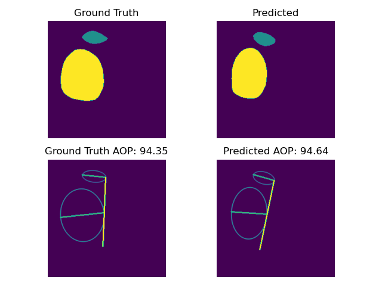

# MICCAI 2023 FH-PS-AOP Challenge

## Challenge Participation - Team Aloha

###### [Marawan Elbatel](https://marwankefah.github.io/), [Robert Martí](https://scholar.google.com/citations?user=M_sM6x8AAAAJ&hl=en), [Xiaomeng Li](https://xmengli.github.io/)
This repository contains the official
implementation of Team Aloha's participation in the 
semantic segmentation challenge [FH-PS-AOP Challenge](https://ps-fh-aop-2023.grand-challenge.org/) in Ultrasound Imaging. Additionally, it includes an unofficial implementation of the angle of progression estimation and the scoring mechanism used in the challenge, pending official release by the organizers.


## Abstract
Inspired by the recent Segment Anything Model (SAM) and the positional priors observed in transperineal ultrasound imaging of Pubic Symphysis and Fetal
Head, we adapt SAM to ultrasound imaging. To preserve SAM’s generalization capability while adapting to ultrasound imaging, we freeze the
model and perform efficient low-ranked fine-tuning of the image encoder.
The low-ranked fine-tuning can preserve the generalization capabilities
of the pre-trained SAM model while being compact during inference.
During inference, we integrate robust test-time augmentation techniques
and employ a soft-ensemble approach based on 5-fold splits. The performance evaluation on the test set demonstrates the superiority of SAM on **7 out of 8** reported segmentation metric.

## Training SAM Model

To train the SAM model, please follow the instructions provided in the [train_sam.ipynb](train/train_sam.ipynb) notebook. 

```
# pretrained weights are available 
gdown https://drive.google.com/uc?id=1dcmSzq3KsL7DOEBDotwOyzLAtNFBD6AI
```
## Generating Predictions

To generate predictions using the trained model / weights, execute the relevant code provided in the [output_predictions.ipynb](train/output_predictions.ipynb) notebook.

## AOP estimation
The unofficial implementation of the angle of progression estimation can be found in [aop.py](aop.py).



## Calculating Final Score

To calculate the final score for your output, see [sample_output](train/sample_output) and run
```
python score.py
```

## Challenge Final Results
Please note that it has come to our attention that some values, such as dice_ps, are not reported in all submission aggregates. 
Furthermore, we have identified a discrepancy between our implemented score equation of the fully reported aggregated values and the presented values detailed [here](https://grand-challenge.org/forums/forum/pubic-symphysis-fetal-head-segmentation-and-angle-of-progression-668/topic/possible-score-calculation-error-1874/) and [here](https://grand-challenge.org/forums/forum/pubic-symphysis-fetal-head-segmentation-and-angle-of-progression-668/topic/re-evaluation-past-submission-request-and-score-calculation-1899/) supported with [Colab](https://colab.research.google.com/drive/1uxSogwBL7G1woSFdpN02VYG4_4kFYVME?usp=sharing#scrollTo=3k3jdvctOmb4).
We are currently awaiting clarification from the organizers regarding these discrepancies. We will provide further updates once we receive clarification


| Team           | AOP       | HD_FH      | HD_PS     | ASD_FH    | ASD_PS    | HD_ALL     | ASD_ALL   | DICE_FH   | DICE_PS | DICE_ALL  | Score  |
|----------------|-----------|------------|-----------|-----------|-----------|------------|-----------|-----------|---------|-----------|--------|
| Raphael96      | 6.544     | 12.631     | 7.638     | 3.896     | 2.409     | 13.448     | 3.486     | 0.930     | ??      | 0.924     | 0.9418 |
| marwankefah    | 7.970     | **10.699** | **7.559** | **3.307** | 2.995     | **12.059** | **2.981** | **0.940** | ??      | **0.935** | 0.9416 |
| Gregor Koe     | **6.484** | 12.504     | 7.745     | 3.874     | 2.537     | 13.291     | 3.499     | 0.931     | 0.858   | 0.924     | 0.939  |
| QiuYaoyang     | 7.647     | 12.459     | 7.661     | 3.616     | **2.257** | 13.615     | 3.238     | 0.936     | ??      | 0.930     | 0.939  |
| NKCGP          | 8.558     | 14.011     | 9.051     | 3.869     | 2.620     | 15.334     | 3.517     | 0.931     | 0.860   | 0.924     | 0.931  |
| fangyijie.wang | 8.719     | 14.009     | 10.829    | 3.984     | 2.982     | 15.809     | 3.579     | 0.931     | 0.858   | 0.925     | 0.928  |
| 坤坤kk           | 9.276     | 15.795     | 11.536    | 4.723     | 3.114     | 17.560     | 4.265     | 0.918     | 0.831   | 0.910     | 0.923  |
| 柑橘乌云           | 12.199    | 20.031     | 14.068    | 7.099     | 4.208     | 21.873     | 6.058     | 0.879     | 0.804   | 0.872     | 0.897  |
| YuboTan        | 14.048    | 16.041     | 16.023    | 5.199     | 7.260     | 20.251     | 5.106     | 0.910     | ??      | 0.894     | 0.892  |

### Acknowledgment
Code is built on [Segment Anything Model](https://github.com/facebookresearch/segment-anything), [SAMed](https://github.com/hitachinsk/SAMed/tree/main), and [SAM LoRA](https://github.com/JamesQFreeman/Sam_LoRA). 

